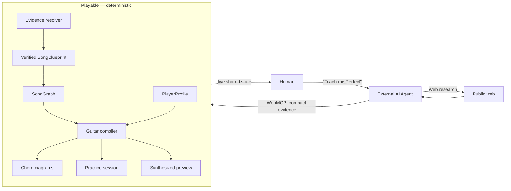

# Playable — Teach Me Any Song

> **Learning an instrument shouldn't start with 40 beginner videos. Name a song to your agent, it researches the web, Playable verifies the facts and builds a version you can actually play and practice.**


You say:

```text
"I want to learn Perfect by Ed Sheeran. I'm a complete beginner."
```

Your AI agent researches the public web, Playable **verifies** what it finds,
the deterministic compiler **adapts** the song to your hands, and you
**practice** it in the browser.

```text
Agent researches  →  Playable verifies  →  Compiler adapts  →  You practice
```

For generations, beginner music education has leaned on the same generic
exercises and simplified songs — not because that is the music learners care
about, but because adapting arbitrary real music to every individual student's
current ability is expensive, manual work. Playable makes adaptation
computational. The learner names the music they actually care about, their AI
agent does the research, and Playable turns verified facts into a playable
arrangement at their level.

> **Don't make me ready for the song. Make the song ready for me.**

The argument is about motivation, not a claim that foundational technique is
worthless — it is that the fastest way to keep a beginner practicing is to
start from music they already love, and adapt it to where they are.

---

## Why Playable is agent-native

AI agents are increasingly the first interface people reach for when they want
to research, plan, learn, compare, create, and act. Playable does not wrap a
chatbot inside a guitar site — it exposes the music-learning system itself to
the agent. The human says **what they want, what they know, and how much time
they have**; the agent handles orchestration and live web research; the
application performs the deterministic domain work.

That is why WebMCP is central to this project, not decorative.

### Why WebMCP is the right split

A cover song cannot simply be ingested from a streaming link: streaming
services do not expose analyzable PCM, and downloading protected audio is not
an acceptable architecture. But the compact facts needed to model a song —
its key, tempo, meter, harmonic vocabulary, section progressions — already
exist in public form across chord resources, tempo databases, and music
encyclopedias.

- **Finding and reconciling those facts is a research problem.** Agents are
  excellent at research.
- **Turning verified facts into a player-specific guitar arrangement is a
  compilation problem.** That work benefits from deterministic software:
  music-theory normalization, constraint search, difficulty scoring, fingering
  optimization, synthesis.

No single opaque model should be responsible for both. WebMCP is the
composition boundary:

| | External agent | Playable |
| --- | -------------: | -------: |
| Understand human intent | ✓ | |
| Search the live public web | ✓ | |
| Find and cite source URLs | ✓ | |
| Submit compact evidence | ✓ | |
| Verify source agreement | | ✓ |
| Music-theory normalization | | ✓ |
| Resolve conflicts | | ✓ |
| Arrangement search | | ✓ |
| Difficulty scoring | | ✓ |
| Fingering optimization | | ✓ |
| Audio synthesis | | ✓ |

> **The model proposes; the page verifies.** Playable accepts compact
> *sourced* evidence. It does not accept the agent's unsupported musical
> assertions as truth — unsourced claims carry near-zero weight, and
> conflicting claims become visible conflicts rather than a silent average.

## Native WebMCP

Playable registers its capabilities directly through
`document.modelContext.registerTool` — no wrapper SDK, no backend agent. All
**24 tools** live in
[`src/webmcp/register-tools.ts`](src/webmcp/register-tools.ts). A real
registration from that file:

```ts
await register({
  name: 'request_song',
  description:
    'START HERE when the user asks to learn a song by name (title/artist), e.g. "Teach me Perfect by Ed Sheeran". This selects the requested recording and begins the song-understanding workflow. No Spotify, YouTube or audio link is needed — do not ask the user for one. After this call, follow nextSuggestedTools: usually get_song_research_brief next, because a named song must be researched and verified from independent public sources before it can be compiled into a guitar arrangement.',
  inputSchema: {
    type: 'object',
    properties: {
      title: { type: 'string', description: 'Song title, e.g. "Perfect".' },
      artist: { type: 'string', description: 'Artist name, e.g. "Ed Sheeran". Strongly recommended — a title-only request is ambiguous and returns IDENTITY_NEEDS_CONFIRMATION.' },
      query: { type: 'string', description: 'Free text like "Perfect by Ed Sheeran" when title/artist are not separated.' },
      version: { type: 'string', description: 'Optional: studio, live, acoustic, remix — prevents mixing recordings.' },
    },
  },
  execute: async (input) => { /* → requestSong(...) in tool-context.ts */ },
});
```

### Tool surface (24 tools)

| Stage | Tools |
| --- | --- |
| Song intake | `request_song` · `load_song_from_link` · `search_licensed_music` · `load_licensed_track` · `get_guitar_app_state` |
| Research | `begin_song_research` · `get_song_research_brief` · `submit_song_evidence` · `get_song_research_status` |
| Song resolution | `validate_song_blueprint` · `get_song_blueprint` · `resolve_researched_song` |
| Player | `set_player_level` · `set_player_profile` · `get_player_profile` |
| Arrangement | `analyze_song` · `compare_guitar_levels` · `compile_guitar_version` · `explain_guitar_version` · `get_arrangement_diagnostics` |
| Practice | `choose_learning_section` · `create_practice_plan` · `configure_practice_session` · `prepare_practice_preview` |

Every tool has an explicit JSON-Schema `inputSchema`, validation with
state-aware errors, and read-only tools carry
`annotations: { readOnlyHint: true }`. No tool touches the filesystem, shell,
or server control.

### Self-describing workflow

You never prompt the agent with the tool sequence. Tool descriptions and
results carry `nextSuggestedTools` (with reasons and priorities), research
briefs list exactly which facts are missing and suggest public-web queries for
them, and errors explain the current state and the way out
(`IDENTITY_NEEDS_CONFIRMATION`, `SONG_NOT_COMPILABLE`,
`BLUEPRINT_NOT_READY`). The interface teaches the agent how to accomplish the
goal. The whole user input is:

```text
Teach me "Perfect" by Ed Sheeran.
I'm a complete beginner.
```

## Architecture



One process serves the UI, the API, and the WebMCP page from a single origin
(`src/demo/server.ts` — a dependency-free Node HTTP server). The browser
client (`src/demo/client.ts`) and the WebMCP tool layer
(`src/webmcp/register-tools.ts`) call **the same** actions in
`src/webmcp/tool-context.ts` over **the same** shared `AppState`:

```text
WebMCP tool call  ─┐
                   ├─→  tool-context actions  →  shared AppState  ← UI buttons
HTTP API (server) ─┘
```

There is no hidden parallel "AI state". Every agent action becomes visible in
the UI, every UI control moves state the agent can inspect, and the browser
output is a truthful projection of application state. The single deliberate
boundary: tools can **prepare** the practice preview, but only a human click
plays audio — there is no autoplay anywhere.

## The research pipeline

The hero path never touches audio. Compact facts flow through a deterministic
resolver (`src/engines/research/`, `src/application/research-song.ts`):

```text
SongRequest
  ↓
Research Brief                ← what is known / missing / conflicting + suggested queries
  ↓
Evidence Claims               ← compact fact + source URL + source family + field
  ↓
Source-Family Normalization   ← same registrable domain = ONE family
  ↓
Field Consensus / Conflicts   ← per-field clustering, transposition + pulse hypotheses
  ↓
Verified SongBlueprint
  ↓
SongGraph
```

### Evidence model

The agent submits **compact claims** — one chord, one tempo, one key — each
with its source URL. Never a full page dump, never lyrics, never a full tab.
Submissions are size-capped (`EVIDENCE_TOO_LARGE` beyond the cap), and every
claim keeps its provenance so any resolved value can answer *"where did this
come from?"*

### Independent source confidence

Confidence is a noisy-OR over **independent source families**, where a family
is a registrable domain (`domainFamilyOf` in
`src/domain/song-research/evidence-source.ts`). Five URLs that all copy the
same upstream database count as **one** confirmation, not five. Weighted
priors are claim-specific; agreement *within* a family is near-worthless
compared to agreement *across* families (`src/engines/research/evidence-cluster.ts`).

### From messy web facts to one Song Blueprint

The normalizer (`src/engines/research/evidence-normalizer.ts`) reconciles the
way the web actually writes about music:

- **Enharmonic normalization** — `G# ≡ Ab`, `C# ≡ Db`; a single centralized
  spelling layer with a preferred display spelling derived from the evidence
  (and impossible spellings like `Fb` rejected, not "fixed").
- **Chord parsing** — chord symbols parse into root, quality, and sounding
  pitch class, so claims can agree at the right semantic level.
- **Capo invariant** — guitar-shape evidence is converted to sounding harmony:
  at capo 1, played `G Em C D` *is* sounding `Ab Fm Db Eb`. Both descriptions
  of the same progression merge instead of fighting.
- **Metrical tempo clustering** — reports of 63, 126, and 189 BPM may describe
  one pulse hierarchy. Candidates cluster by ratio (double-time, cut-time,
  triple feel) with a resolved *practice* pulse; the resolver never blindly
  averages them.
- **Transposition hypotheses** — two sources whose progressions differ by a
  constant semitone shift are flagged as likely transposed equivalents
  (`LIKELY_TRANSPOSED_EQUIVALENT`) rather than irreconcilable conflicts.
- **Approximate structure** — unsupported song structure stays section-relative
  (`SECTION_ONLY` timing). The resolver does not invent timestamps.

The resolved `SongBlueprint` carries identity (including MusicBrainz
recording ID / ISRC when found), key, tempo with related reported BPMs, meter
with alternatives, per-section harmony, section order, per-field confidence,
explicit **conflicts**, **gaps**, and warnings
(`src/domain/song-research/research-resolution.ts`). The compiler consumes the
structured `SongGraph` built from it — never free-form model text.

## The deterministic guitar compiler

```text
Verified SongGraph + PlayerProfile
  ↓
Candidate transformations (bounded chains)
  ↓
Difficulty + fidelity scoring
  ↓
Beam search → Pareto selection
  ↓
Playable arrangement
```

Six transformation operators
(`src/engines/transformations/`): **capo optimization**, **chord
simplification**, **rhythm simplification**, **tempo reduction**, **fingering
optimization**, and **melody reduction**. Candidates are chained and explored
by a deterministic beam search (`src/engines/arrangement/candidate-search.ts`:
beam width 12, depth 3, max 50 candidates — no randomness anywhere), then
Pareto-filtered over the two objectives. Search beats asking an LLM to invent
chord substitutions: the results are verifiable, reproducible, and scored.

**Why search instead of a model?** A transformation only earns its place by
actually measuring easier *for this player*. If no capo and the original open
chords are genuinely optimal, Playable keeps them instead of forcing a
visually dramatic transformation. If a capo turns unfamiliar barre shapes into
open shapes at the same sounding harmony, it picks that. Every result answers
two questions:

- **Why is this easier for me?** (`explain_guitar_version`,
  `get_arrangement_diagnostics` — e.g. `BARRE_REDUCTION`, open voicings,
  simpler transitions, difficulty before/after)
- **What musical information did we preserve?** (fidelity scoring over
  harmony, rhythm, melody, and motif coverage —
  `src/engines/fidelity/`)

Difficulty is player-relative: a `PlayerProfile` (skill level, known chords,
barre comfort, comfortable tempo, techniques —
`src/domain/player/player-profile.ts`) re-scores every candidate. The
compiler maximizes fidelity *subject to* what this specific player can do,
and reports `constraintsSatisfied: false` with the closest version when
constraints can't be met — an honest fallback, not a silent compromise.

Fingering is real optimization: monophonic lines are assigned positions by a
Viterbi-style dynamic program over all valid fretboard positions, minimizing
cumulative transition cost (`src/engines/guitar/position-optimizer.ts`).
Unplayable notes throw — nothing is silently dropped or transposed.

## Practice: from arrangement to sound

```text
compiled arrangement
  → section selection     (recommend the section to learn first)
  → practice plan         (steps sized to your minutes)
  → session configuration (section loop · tempo factor · metronome · count-in)
  → preview preparation   (rendered, never autoplayed)
```

Preview audio is synthesized with a **Karplus–Strong plucked-string model**
written in TypeScript on the Web Audio API
(`src/audio-rendering/ks-voice.ts`). It is pure math — no samples, no music
generation model. The invariant that matters:

> **The diagrams and the sound come from the same arrangement object.** The
> renderer is an instrument played by the compiler's exact note choices —
> not a disconnected backing track, not streaming audio, not a generative
> model.

`prepare_practice_preview` prepares the audio; **a human presses Play.**

## Try it

### Requirements

- Node ≥ 20 (deployment uses Node 24), pnpm 11 (`corepack enable`)
- To test WebMCP locally: Chrome 149+, or Chrome with
  `chrome://flags/#enable-webmcp-testing` enabled, or an agent browser with
  native WebMCP support. Browser support for WebMCP is **experimental** — the
  app degrades gracefully: without it you get the full UI, link path, and a
  manual tool invoker.

### Install & run

```bash
git clone https://github.com/oguzhan-sinik/playable-guitar-webmcp.git
cd playable-guitar-webmcp
pnpm install
pnpm build        # bundle the WebMCP client → demo/app.js
pnpm start        # http://localhost:3847
```

`pnpm demo` is a convenience alias that rebuilds nothing and restarts the
server; `pnpm demo:all` builds then starts. See `.env.example` for the
(all optional) configuration — **the app runs with zero secrets and zero API
keys.** `/health` returns `{"ok":true,"service":"guitar-webmcp"}`.

### Agent test

Open the app in a WebMCP-capable browser and say:

```text
Open the Playable app.

I want to learn "Perfect" by Ed Sheeran.
I'm a complete beginner.

Use the WebMCP tools on this page and make it playable for me.
```

That's the entire prompt — the tools' own descriptions and
`nextSuggestedTools` carry the workflow. Verify registration in the console:

```js
(await document.modelContext.getTools()).map((t) => t.name)
```

Append `?debug=webmcp` for the debug panel: connection state, the full tool
table (read-only vs mutating, last call + duration + result), a manual invoker
that calls the same action layer the agent reaches, and a development replay
that pushes a synthetic research fixture through the real resolver.

## Project structure

```text
src/
  webmcp/          native WebMCP registrations + shared action layer (tool-context)
  demo/            single-origin HTTP server + browser client
  application/     research, compilation, link-loading use cases
  engines/
    research/      evidence clustering, consensus, resolver
    arrangement/   candidate search, Pareto filter, explainability
    difficulty/    player-relative difficulty model
    fidelity/      harmony/rhythm/melody/motif similarity
    transformations/ capo · chords · rhythm · tempo · fingering · melody
    guitar/        position optimization, chord validation
    songgraph/     audio-analysis → SongGraph (MIR path)
  domain/          music theory, guitar, player, practice, research types
  providers/       Spotify/YouTube/MusicBrainz/Jamendo, yt-dlp/ffmpeg, MIR
  audio-rendering/ Karplus–Strong preview synthesis
tests/             vitest unit + integration suites
seed/              royalty-free committed demo song graph
scripts/           fixture + demo-song generators
```

The optional `mir/` directory (local Python MIR models: madmom, all-in-one,
beat-this) is a dev-only deep-analysis stack — **not required** for the
WebMCP hero flow, which is fully deterministic.

## Deployment

One Render web service serves UI + API + WebMCP page from a single origin
(`render.yaml`). Build: `corepack enable && pnpm install --frozen-lockfile &&
pnpm build`; start: `pnpm start`; health: `/health`. **No required secrets.**
`ALLOW_EXTERNAL_MEDIA_INGEST=false` (set in `render.yaml`) makes YouTube and
direct-audio links research-only on the hosted deployment. The free plan has
an ephemeral filesystem and cold starts; a fresh instance seeds the demo song
from `seed/demo-song/`.

## Design decisions

**Why not analyze Spotify audio?** Streaming links expose no analyzable PCM,
and ripping protected audio is not an acceptable architecture. Spotify links
are used for identity and playback metadata only.

**Why not let the LLM generate the tabs?** Because correctness, provenance,
and reproducibility matter. The same evidence must always compile to the same
arrangement, and every musical fact must be traceable to a source.

**Why not put another agent in the backend?** The external agent already
provides orchestration and research. A second internal model would add
latency, cost, nondeterminism — and blur the responsibility boundary. There
is no LLM anywhere in this codebase.

**Why synthesis instead of the commercial track?** Because the practice sound
should represent the arrangement Playable generated, not the copyrighted
recording.

## Trust, provenance, and responsible use

```text
source → evidence → field consensus → resolved value → compiler
```

Two different forms of explainability are built in: *where did this musical
fact come from?* (per-claim source URLs, per-field confidence, explicit
conflicts) and *why did this arrangement become easier?* (before/after
difficulty breakdowns, fidelity report).

Copyright posture, as implementation choices: Playable ingests **compact
musical facts** with provenance (size-capped, no lyrics, no tab bodies, no
page dumps), never streams or rips audio, requires a human rights attestation
plus a deployment-level flag before any external-media processing, uses
Jamendo only for explicitly download-authorized tracks, and synthesizes its
own practice audio. The hosted demo song is an original instrumental generated
by this repository (`scripts/gen-demo-song.ts`) — no copyrighted recording
ships. Nothing here is a legal guarantee; it is how the system is built.

## Limitations

- Public-source quality varies; some songs have conflicting or sparse
  metadata, and structure can remain approximate (`SECTION_ONLY` timing).
- WebMCP browser support is experimental and changing.
- Research quality depends on the external agent's capabilities.
- The synthesized preview represents *your arrangement* — it is not intended
  to reproduce the commercial recording.
- Arrangements target guitar; other instruments are future work.

## Testing

```bash
pnpm test         # vitest: 323 passing, 7 skipped (as of this release)
pnpm typecheck    # tsc --noEmit, strict
pnpm build        # esbuild client bundle
```

---

Built for the WebMCP hackathon as an exploration of agent-native domain
applications — what happens when an application stops treating AI as a
chatbot embedded inside the product and instead exposes its domain
capabilities directly to agents.

> The agent researches.
> Playable verifies.
> The compiler adapts.
> The human plays.

**Your music. Your level. Playable today.**

## License

[MIT](LICENSE)
